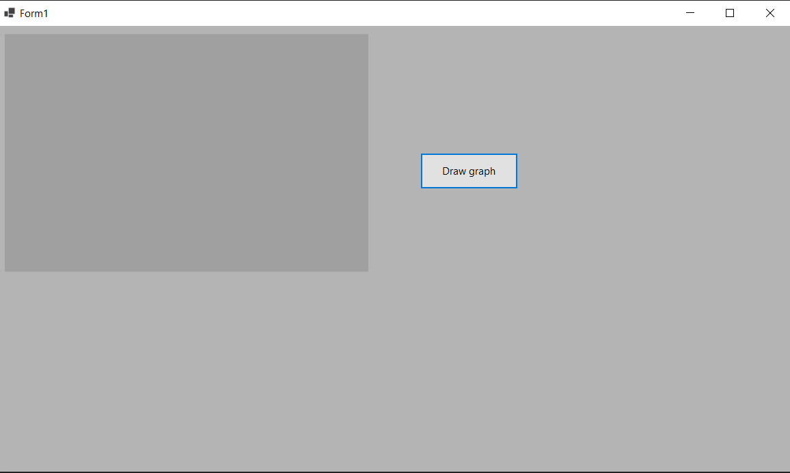

<h1>Информационные системы</h1>

Основная цель проекта - создание приложение для расчета введенной формулы. Приложение состоит из нескольких страниц, включающая так же класс формулы, формы и отдельная часть для тестирования.

<h2>Построение базовой формы</h2>

На начальном этапе требуется создалть общий вид для программы. Требуется создать поле вывода и базовую формулу.

Так же требуется добавить в форму базовые функционалы для формул, различные кнопочки и.т.д.

